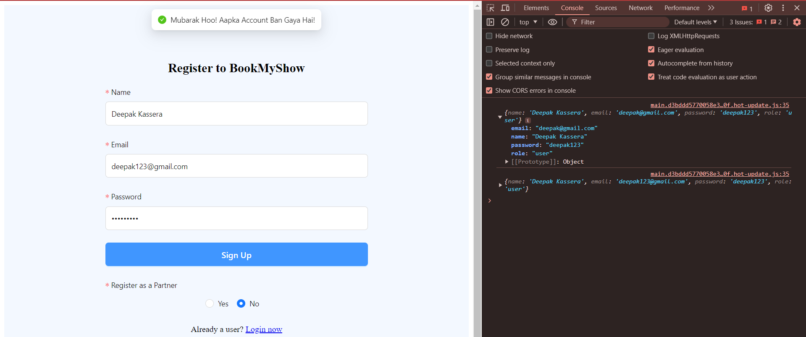
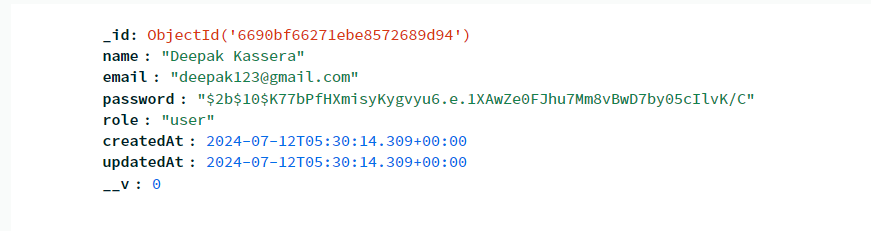
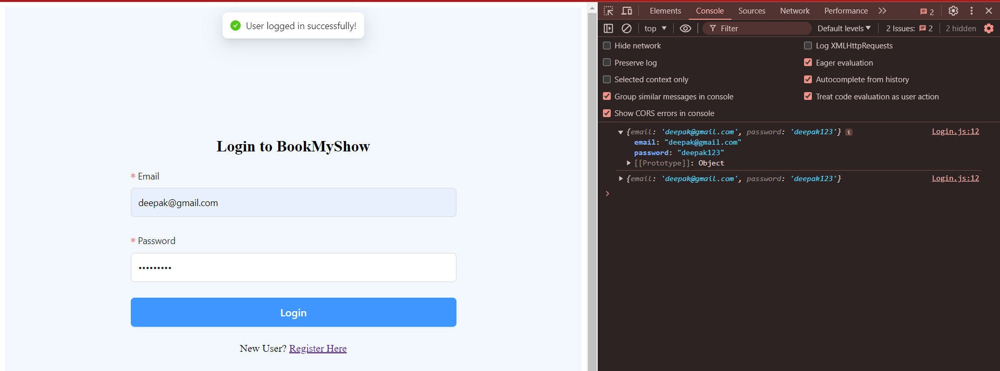
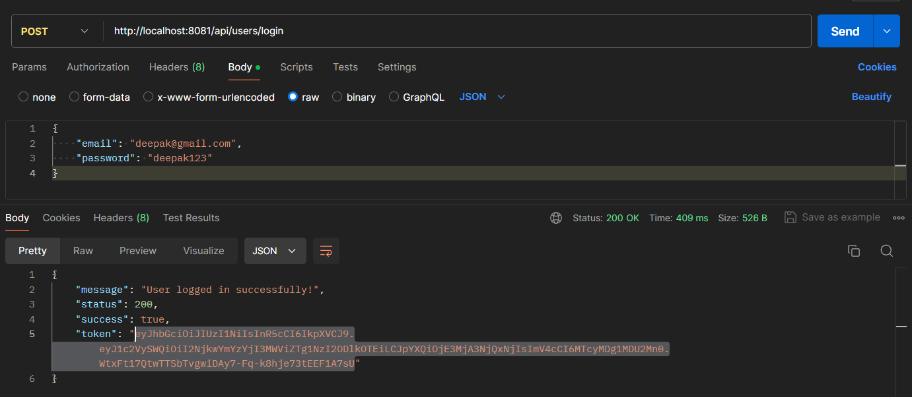
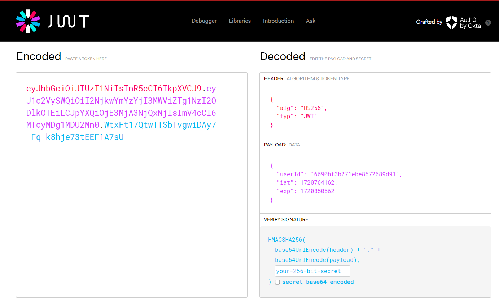
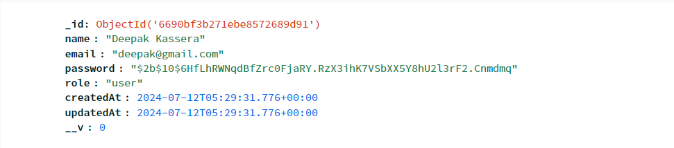
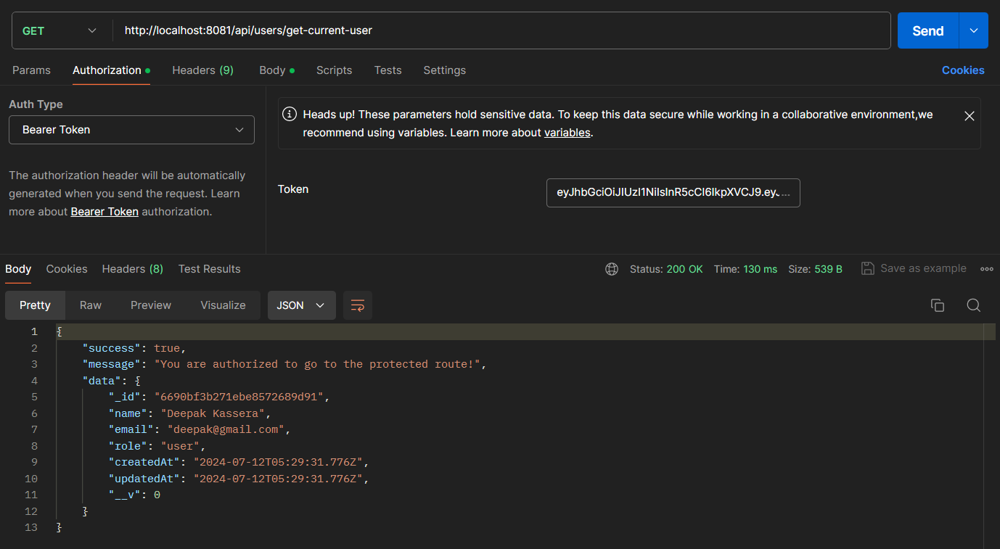
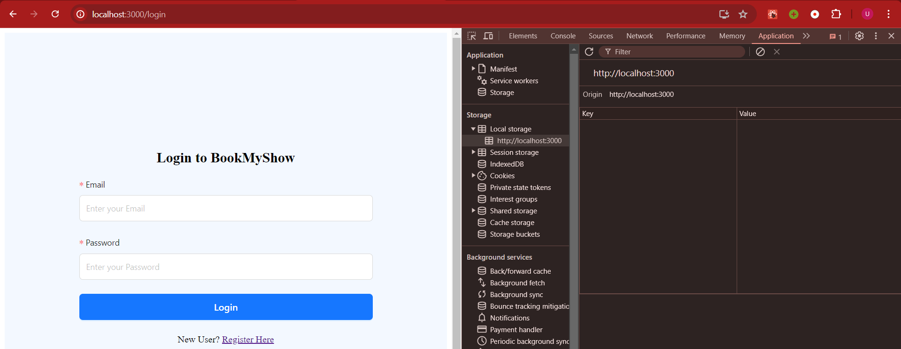
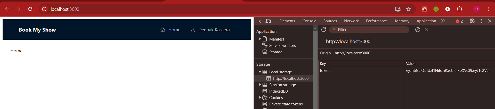

## Axios & Proxy : Client-Server Interaction

### http://localhost:3000/register

### Mongodb Database Updation

### http://localhost:3000/login

## JWT Authentication
#### Token Generation

#### Token Decryption

#### Token Details Matches to the Database Details

### User Authentication using Bearer Token

### Protected Routes
When ever someone want to access the Home Page without Login, then this protected route will redirect the user to the login page.

If the Token is present then it will allow the user to access the Home page.

#### No Access to Login Page when the user was already Logged in
If the Token is present in the Local Storage, that means the user is already logged in. So it will redirect the user to the Home page whenever the user will try to access "/login".

The Login Page only occurs when the Token is absent in the Local Storage.
